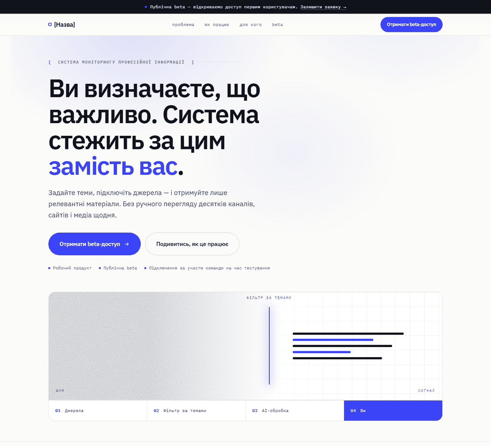

# site-saas-b2b

Односторінковий лендинг для публічного beta-запуску SaaS-продукту —
системи персонального та корпоративного моніторингу професійної інформації.

[](https://github.com/YanisDigital/site-saas-b2b/deployments)


**Демо:** https://yanisdigital.github.io/site-saas-b2b/
· [політика приватності](https://yanisdigital.github.io/site-saas-b2b/privacy.html)

> Портфоліо-приклад. Назва, контакти, скриншоти й відео — умовні
> плейсхолдери; форма заявки працює в демо-режимі й даних не збирає.



---

## Рушій

Ніякого. Голий статичний HTML / CSS / JS без фреймворка, без CMS, без збірки —
на GitHub Pages.

### Деталі стеку

| Шар | Реалізація |
|---|---|
| **Розмітка** | Один документ `index.html`, окрема самодостатня `privacy.html`. Увесь CSS у вбудованому `<style>`, увесь JS — в одному вбудованому IIFE. Зовнішніх JS-ресурсів нуль. |
| **CSS** | Ванільний, без препроцесора та utility-фреймворка. Дизайн-токени через custom properties на `:root`. Розкладка на Flexbox + CSS Grid, флюїдна типографіка через `clamp()`, кілька медіазапитів (один основний брейкпоінт). Сучасні фічі: `color-mix()`, `backdrop-filter`, `mask-image`, SVG `feTurbulence` у `data:` URI для зерна та фонового шуму hero-візуалу. |
| **JS** | ~130 рядків, vanilla, ES5-сумісний, IIFE, нуль залежностей і бандлера. `IntersectionObserver` (scroll-reveal), `fetch` (сабміт форми), `matchMedia` (`prefers-reduced-motion`). Прогресивне покращення: без JS контент видно, форма працює нативно. |
| **Шрифти** | Self-hosted IBM Plex Sans / Mono у `woff2`, `@font-face` з `unicode-range`-сабсетингом (24 правила, українському відвідувачу вантажиться 12 файлів), `preload` двох критичних накреслень. Google Fonts не використовується — жодного запиту до сторонніх доменів. |
| **Форма** | Нативна HTML-валідація, endpoint-агностик через `data-endpoint` (Formspree / Getform / власний API). Захист від ботів: honeypot `_gotcha` + перевірка часу заповнення. Демо-режим при порожньому endpoint. |
| **Хостинг** | GitHub Pages, роздача файлів як є через Fastly CDN, HTTPS форсовано. Jekyll у пайплайні присутній за замовчуванням, але не задіяний (немає `_config.yml`). Рендеринг 100% клієнтський-статичний: ні SSR, ні SSG, ні гідратації. |

Немає `package.json`, `node_modules`, рантайму фреймворка. `scripts/` — Python-утиліти
для генерації ассетів; у роздаваний сайт не входять.

---

## Структура

```
index.html            лендинг (розмітка + вбудовані CSS/JS)
privacy.html           шаблон політики приватності (той самий стиль)
landing-spec.md        специфікація: структура, усі тексти, візуальна система, чек-лист запуску
assets/
  favicon.svg
  og-image.png         1200×630, згенерована (scripts/og-generator.html)
  screenshot.png       для README (headless-знімок hero)
  fonts/               IBM Plex Sans/Mono woff2 + OFL.txt
scripts/
  fetch-fonts.py       перезавантажує підмножини IBM Plex, генерує @font-face
  og-generator.html    малює og-image.png на canvas
  og-server.py         локальний сервер для генератора (127.0.0.1:8790)
```

---

## Локальний запуск

Збірка не потрібна — достатньо будь-якого статичного сервера:

```bash
python -m http.server 8000
# → http://127.0.0.1:8000
```

Відкривати через `file://` не варто: `fetch` і деякі `@font-face` вимагають HTTP.

---

## Деплой

Пуш у `main` → GitHub Pages автоматично передеплоює (~1 хв). Джерело —
гілка `main`, корінь `/`.

---

## Перед реальним запуском

Повний чек-лист — у [`landing-spec.md`](landing-spec.md), розділ 7. Стисло:

1. `[Назва]` → реальна назва (пошук-заміна; словесний знак, `<title>`, OG-теги, футер).
2. `data-endpoint` на формі → Formspree / Getform / власний API (автоматично вимикає демо-режим).
3. Заповнити всі `[плейсхолдери]` у `privacy.html`, прибрати демо-банер. **Обов'язково до підключення endpoint.**
4. Контакт у футері та в тексті помилки форми.
5. Абсолютні `og:url` / `og:image` — оновити домен при переїзді з GitHub Pages.
6. Відео, 4 скриншоти (+ `alt`), перегенерувати `og-image.png` після зміни назви.
7. Прибрати демо-примітку у футері.

---

## Шрифти

IBM Plex — [SIL Open Font License 1.1](assets/fonts/OFL.txt).
